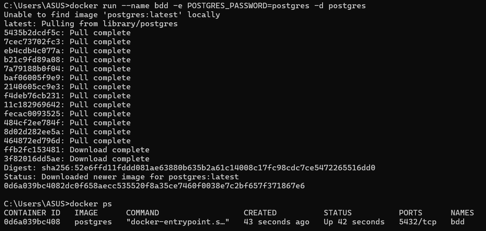
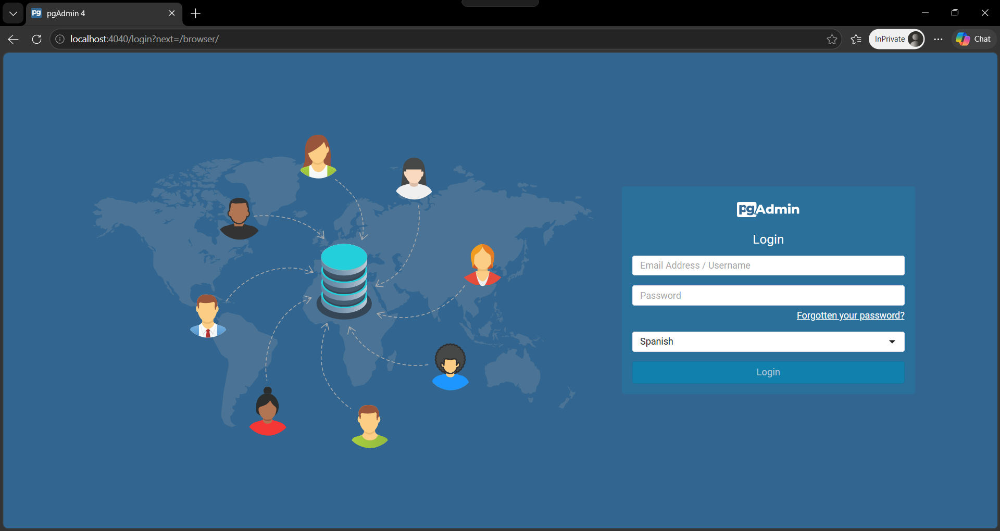
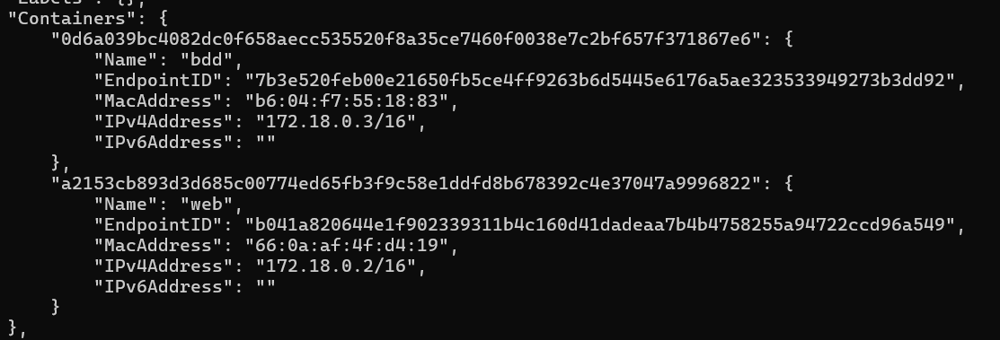
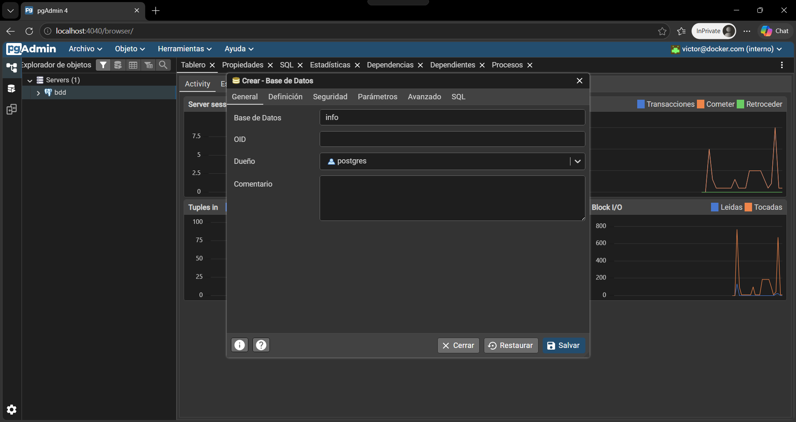
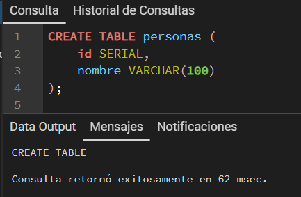
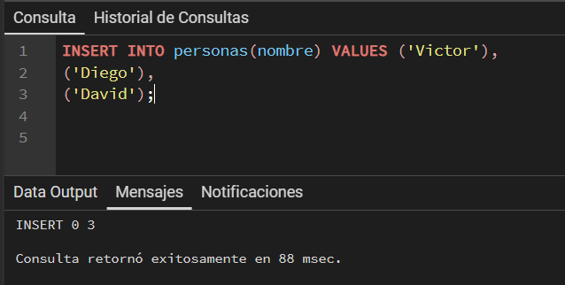
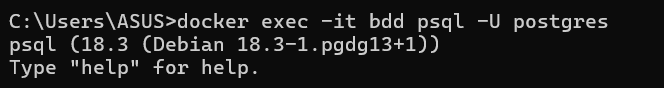
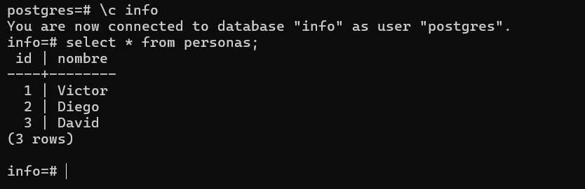

### Crear contenedor de Postgres sin que exponga los puertos. Usar la imagen: postgres:15-alpine3.21
# COMPLETAR

```
docker run --name bdd -e POSTGRES_PASSWORD=postgres -d postgres
```



### Crear un cliente de postgres. Usar la imagen: dpage/pgadmin4

```
docker run -d --name web -e PGADMIN_DEFAULT_EMAIL=victor@docker.com -e PGADMIN_DEFAULT_PASSWORD=postgres -p 4040:80 dpage/pgadmin4
```

# COMPLETAR

La figura presenta el esquema creado en donde los puertos son:
- a: 4040
- b: 80
- c: 5432


## Desde el cliente
### Acceder desde el cliente al servidor postgres creado.
# COMPLETAR CON UNA CAPTURA DEL LOGIN






### Crear la base de datos info, y dentro de esa base la tabla personas, con id (serial) y nombre (varchar), agregar un par de registros en la tabla, obligatorio incluir su nombre.









## Desde el servidor postgresl
### Acceder al servidor
### Conectarse a la base de datos info
# COMPLETAR

```
docker exec -it bdd psql -U postgres
```



### Realizar un select *from personas
# AGREGAR UNA CAPTURA DE PANTALLA DEL RESULTADO

