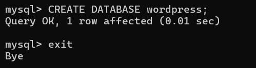
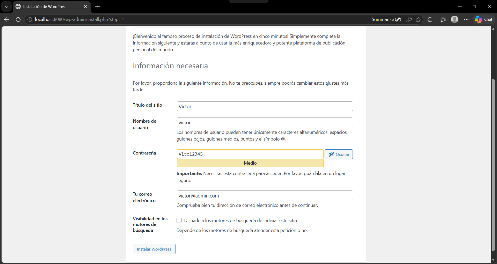
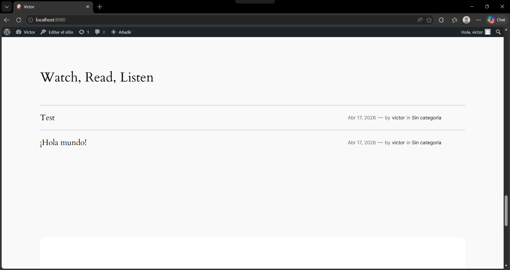
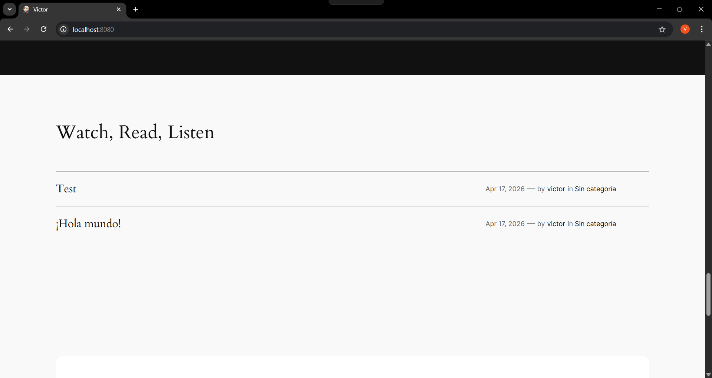

## Esquema para el ejercicio


### Crear la red
# COMPLETAR
```
docker network create net-wp -d bridge
```


### Crear el contenedor mysql a partir de la imagen mysql:8, configurar las variables de entorno necesarias
# COMPLETAR
```
docker run -P -d --name mysql -e MYSQL_ROOT_PASSWORD=admin mysql:8
```

### Crear el contenedor wordpress a partir de la imagen: wordpress, configurar las variables de entorno necesarias
# COMPLETAR
```
docker run --name contenedor-wp -p 8080:80 -d --network net-wp -e WORDPRESS_DB_HOST=mysql -e WORDPRESS_DB_USER=root -e WORDPRESS_DB_PASSWORD=admin wordpress
```


De acuerdo con el trabajo realizado, en el esquema del ejercicio el puerto a es 8080

Ingresar desde el navegador al wordpress y finalizar la configuración de instalación.
# COLOCAR UNA CAPTURA DE LA CONFIGURACIÓN



Desde el panel de admin: cambiar el tema y crear una nueva publicación.
Ingresar a: http://localhost:8080/ 
recordar que a es el puerto que usó para el mapeo con wordpress
# COLOCAR UNA CAPTURA DEL SITO EN DONDE SEA VISIBLE LA PUBLICACIÓN.



### Eliminar el contenedor wordpress
# COMPLETAR
```
docker rm -f contenedor-wp
```

### Crear nuevamente el contenedor wordpress
Ingresar a: http://localhost:8080/ 
recordar que a es el puerto que usó para el mapeo con wordpress

### ¿Qué ha sucedido, qué puede observar?
# COMPLETAR

La publicación que realice sigue presente, esto debido a que esta información se guardo en la base de datos, contenedor el cual no se eliminó, por ende la publicación persiste



